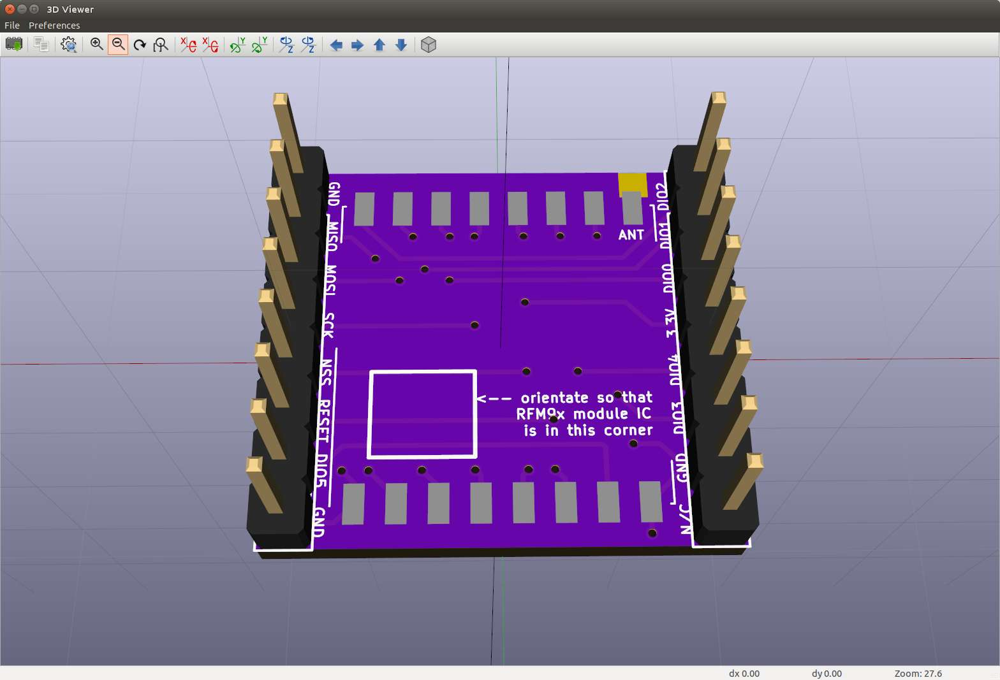

# RFM9x radio module breakout board

This PCB allows an RFM9x (RFM95, RFM96, RFM97, RFM98) modules to be mounted on
a breadboard. 

I've rotated the RFM module 90 degrees to keep the width as small as possible. 
The width separating the pin headers is 0.8 inches (20.32mm) which is narrow 
enough to have at least one available contact  point on each side.

As of 2018-04-18 this has been submitted for fabrication. I'll update this
note when the board arrives and the design has been verified. 

Arrived 2018-05-03. Tested 2018-05-08. Works, only problem is the tiny font
of the pin labels. Increased font size by 50% (to 0.75mm) and resubmitted as
version 1.0.1.
